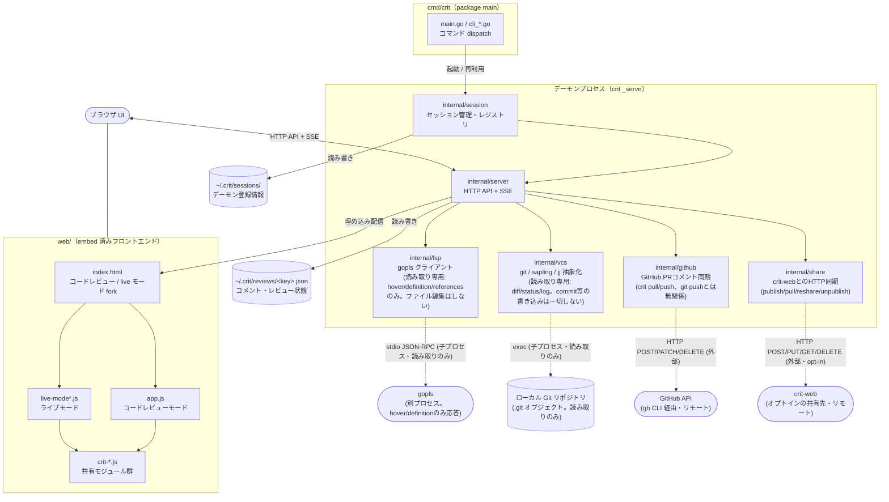
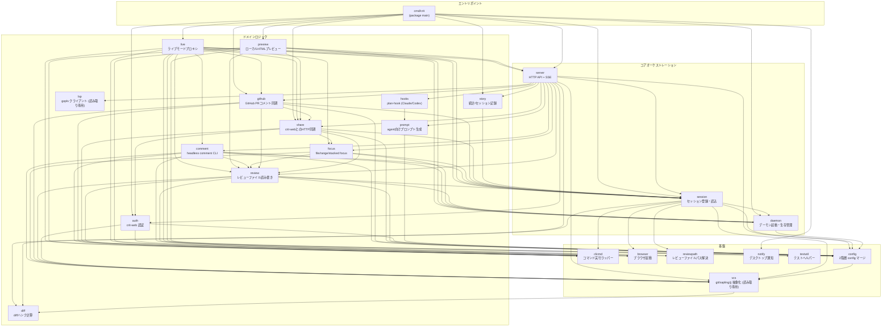
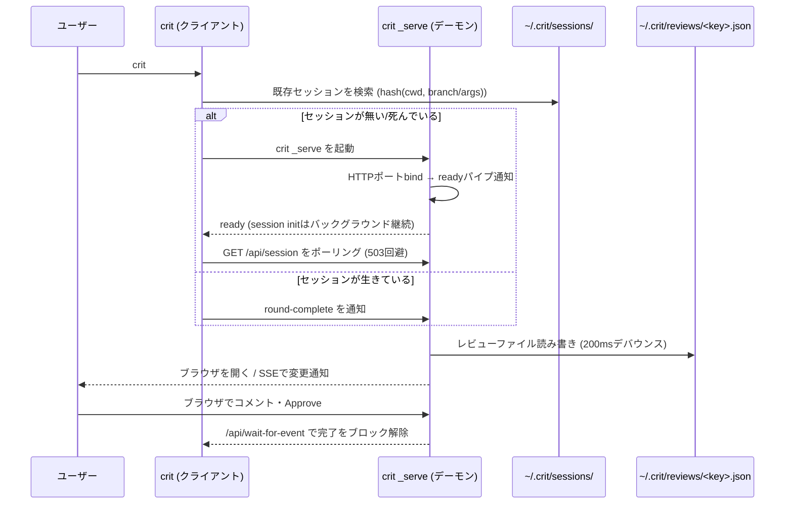
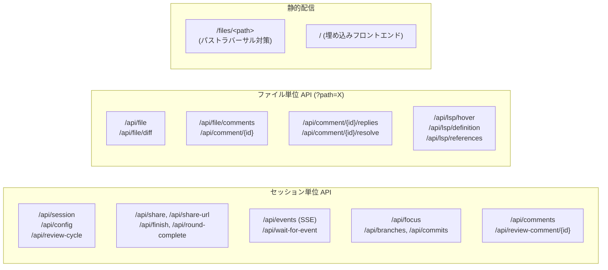
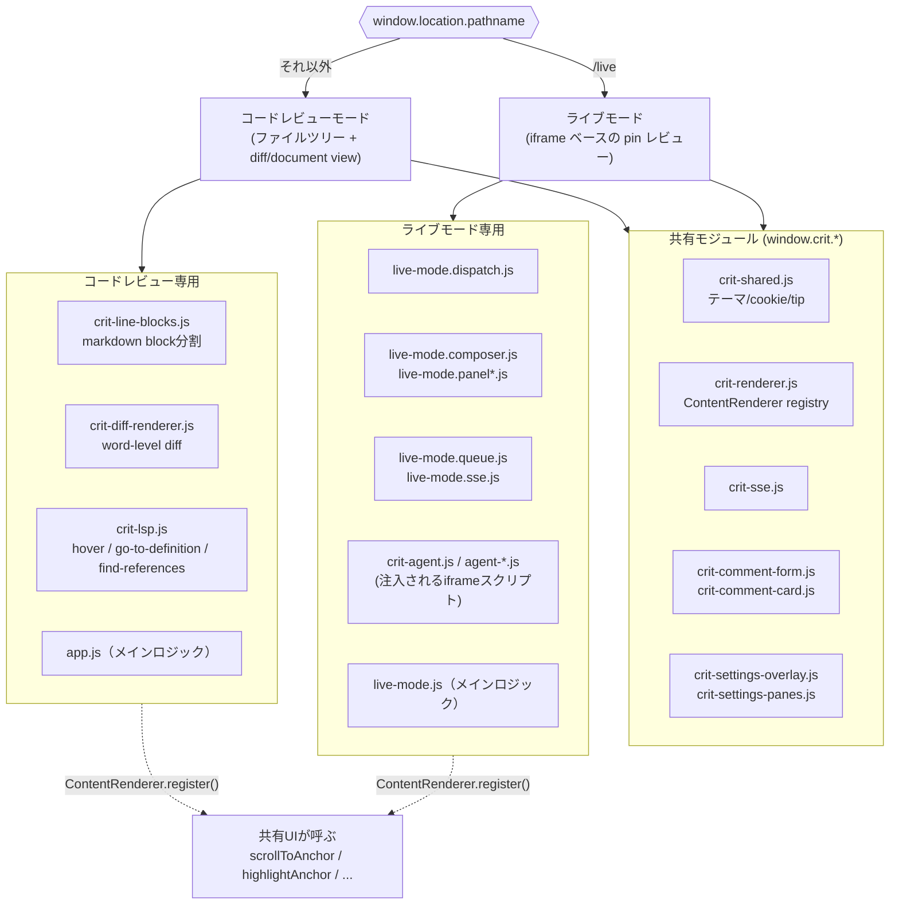
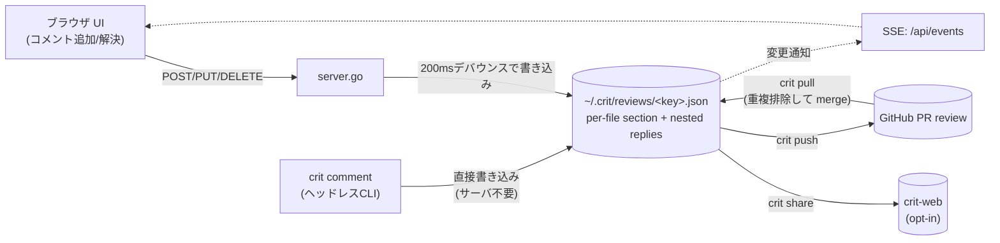

# crit アーキテクチャ概観

crit は「単一バイナリの Go 製 CLI」で、ブラウザ UI を起動してコードレビュー（GitHub PR ライクなインラインコメント）を行うツール。フロントエンドは `embed.FS` でバイナリに埋め込まれており、npm/webpack 等のビルドステップを持たない vanilla JS。

## 1. 全体構成



図形の凡例: 円柱 `[( )]` = 実データが存在する場所（`~/.crit/reviews/`, `~/.crit/sessions/` は crit が書き込む所有データ、`.git` は crit が読み取るだけの他者所有データ）。角丸 `( )` = 別プロセス／リモートサービス（gopls, GitHub API, crit-web）で、crit 自身のストレージではない。破線 `-.->` は「別プロセスの起動」または「外部HTTP呼び出し」を表す（実線は自プロセス内の関数呼び出し・自己所有データへの読み書き）。

各連携先の実態:
- **`internal/vcs` → ローカル Git リポジトリ**: `git diff`/`status`/`log`/`show`/`rev-parse` 等の**読み取り専用**シェルアウトのみ。`commit`/`add`/`checkout`/`push`/`reset` は一切実行しない（sapling/jjバックエンドも同様に読み取りのみ）。
- **`internal/lsp` → gopls**: stdioでJSON-RPC（LSP）を送信するが `initialize` / `textDocument/hover` / `textDocument/definition` / `textDocument/references` / `shutdown` のみ。`workspace/applyEdit` 等の書き込み系は使わず、ファイルもgoplsの状態も変更しない。
- **`internal/github` → GitHub API**: `crit pull` は PRコメントを取得するのみ（GET相当）。`crit push` はPRへ新規レビュー投稿（POST）、返信投稿（POST）、コメント編集（PATCH）、削除（DELETE）を行う——`git push`（コード送信）とは無関係。
- **`internal/share` → crit-web**: `crit share`＝新規公開（POST `/api/reviews`）、再共有＝更新（PUT）、コメント取り込み＝取得（GET）、`crit unpublish`＝削除（DELETE）。オプトイン（`share_url`未設定なら通信しない）。

## 2. コンポーネント図（Go パッケージ依存関係）

`go list` で `internal/*` の実際の import 関係を確認した上での構成（`cmd/crit` は表示簡略化のため主要な依存のみ）。



- **`server` が最大のハブ**: HTTP API 層は auth/comment/diff/focus/github/hooks/lsp/prompt/review/session/share/story/vcs のほぼ全ドメインパッケージに依存する（route dispatch の性質上妥当）。
- **`session` と `review` が下位共有基盤**: comment・focus・github・share・live・preview のいずれもこの2つを経由してレビューファイル・セッション状態にアクセスする。
- **`vcs` が最下層**: config・review・session・comment・focus・github・auth が git/sapling/jj 抽象化に依存し、`vcs` 自体は `diff` のみに依存する葉に近いパッケージ。
- **循環依存なし**: 上記は全て一方向（`server`→ domain → foundation）で、`internal` 配下に import サイクルは存在しない。
- **`live` と `preview` が唯一 `server` に依存する非エントリパッケージ**: どちらもレビュー用サーバーを内部で起動・再利用するため（ライブモードのiframeプロキシ、ローカルHTMLプレビュー）。

## 3. デーモンとセッションのライフサイクル

`crit` は毎回プロセスを起動し直すのではなく、cwd + 引数（+ git モードでは branch）から算出したキーでバックグラウンドデーモンを再利用する。



- **Lazy init + Readiness gate**: `/api/health` と `/api/qr` 以外の全エンドポイントは `SetSession()` 完了まで 503 を返す。クライアントは `/api/session` をポーリングしてから他のAPIを叩く。
- **Idle 無し**: デーモンは Ctrl+C / `crit stop` / シグナルでのみ終了する（アイドルタイムアウトなし）。
- **LSP だけ例外的に lazy start + idle shutdown**: 初回の LSP リクエストで `gopls` を起動し、10分未使用で自動終了。デーモン終了時にも kill される。

## 4. HTTP API の構造（`internal/server`）



- 状態変更系（POST/PUT/PATCH/DELETE）は `Sec-Fetch-Site: cross-site` を拒否（loopback への CSRF 対策）。
- `--allow-unauthenticated-network` なしでは `127.0.0.1` 以外へのバインドや `public_url` 設定を拒否。

## 5. フロントエンド：Two-Paradigm ページフォーク

`index.html` が単一の HTML シェルとして、URL パスに応じて「コードレビューモード」と「ライブモード」のどちらのスクリプト群を読み込むか分岐する。



- 各モードは `ContentRenderer` インターフェース（`scrollToAnchor`, `highlightAnchor`, `getMode` など）を実装して登録し、共有チロム（コメントカードや設定画面）がモードを意識せず呼び出せるようにしている。
- 全モジュールは IIFE + dual-export（`window.crit.<namespace>` と Node向け `module.exports`）で、ES modules は未使用（ビルドステップが無いため）。

## 6. コメント／レビューファイルの永続化



- レビューファイルは `~/.crit/reviews/<key>.json`（cwd + branch、またはファイルモードでは cwd + args でキー化）。
- `crit pull` / `crit push` は GitHub PR コメントとの同期を担い、外部由来のコメントは必ずローカル状態に対して重複排除してからマージする（`buildLocalIDSet` + `buildLocalFingerprintIndex` + `dropDuplicateWebComment`）。

## 7. 主要な設計判断（要約）

| # | 判断 | 理由 |
|---|---|---|
| 1 | フロントエンド資産を `embed.FS` に埋め込み | 単一バイナリ配布を実現 |
| 2 | ビルドステップなし（vanilla JS） | npmはvendorライブラリ取得専用 |
| 3 | git / files の2モード | 変更差分レビューと任意ファイルレビューを両立 |
| 4 | markdown-it を採用 | `token.map` でソース行マッピングが取れる |
| 5 | ブロック単位分割 | リスト/コードブロック/表/引用を行単位でコメント可能に |
| 6 | diffハンクのデュアルガター表示 | old/new行番号を両方表示 |
| 7 | コメントはソース行参照でJSON永続化 | `~/.crit/reviews/<key>.json` |
| 8 | コメント変更毎にレビューファイル書き込み | 200msデバウンスでリアルタイム反映 |
| 9 | ファイル監視（git status polling / mtime polling） | SSE経由でブラウザに反映 |
| 10 | デフォルトで localhost バインド | 非loopbackは明示フラグが必須（認証機構が無いため） |
| 11 | 2階層 config（global/project）+ CLIフラグ | agent_cmd等の機微設定はglobal限定でリポジトリ乗っ取りを防止 |
| 16 | フォーカスモード（file/range/stacked） | PRのスタック化レビューに対応 |
| 17 | Go向けLSP統合（`internal/lsp` → gopls） | lazy start + idle shutdown、デーモン毎に独立したマネージャ |

## 8. ディレクトリマップ（再掲）

```
crit/
├── cmd/crit/            # package main — 薄いCLI (main.go, cli_*.go, wire.go)
├── internal/            # コアロジック (daemon, server, session, github, share, vcs, lsp, …)
├── web/                 # 埋め込みフロントエンド資産 (webassets; embed.go)
├── integrations/        # AIコーディングツール向け設定ファイル (claude-code, cursor, aider, …)
├── test/                # テストハーネス、E2E、roundtripドキュメント
├── Makefile
├── package.json
└── copy-deps.js         # npm依存をweb/にコピーして埋め込み
```
