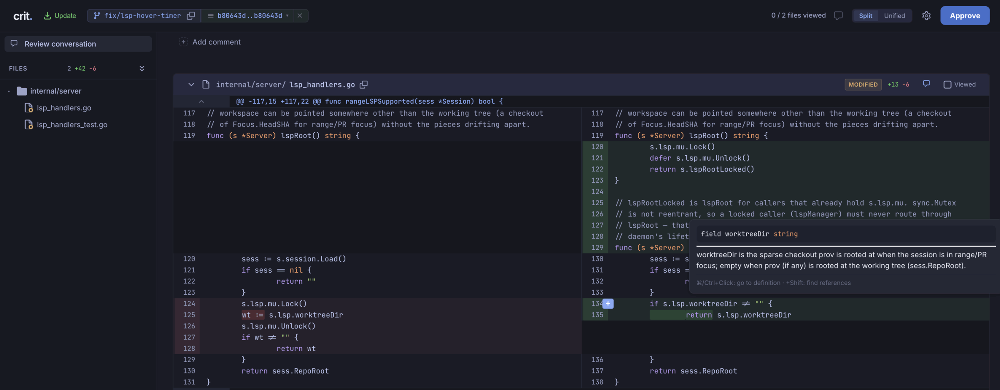
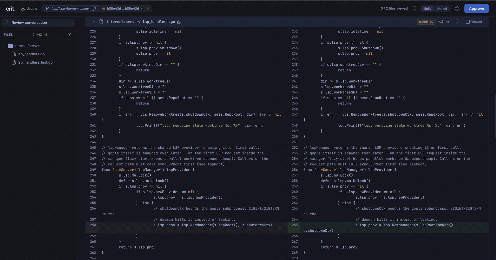
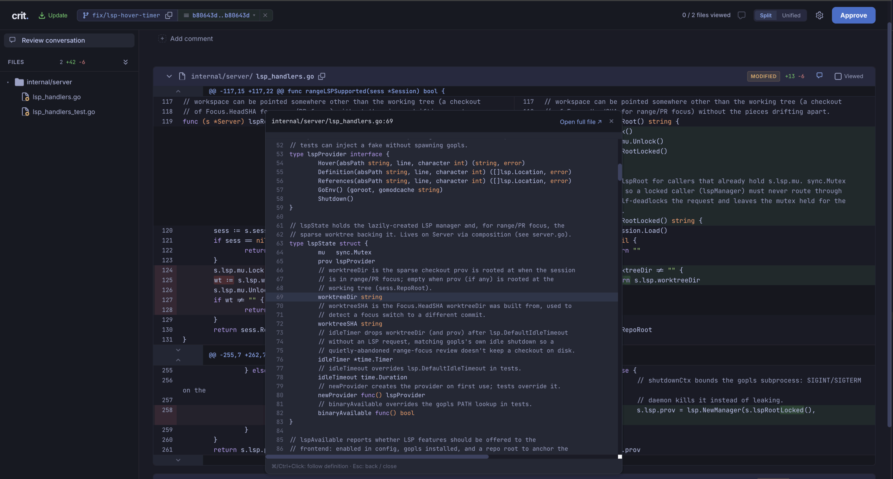
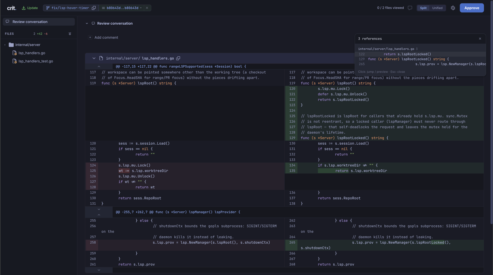

# Crit

[](https://github.com/sho-hata/crit/actions/workflows/test.yml)
[](https://codecov.io/gh/sho-hata/crit)
[](https://github.com/sho-hata/crit/releases)
[](LICENSE)

[English](README.md) | **日本語**

> **これは [tomasz-tomczyk/crit](https://github.com/tomasz-tomczyk/crit) のプライベートフォークです。** 本家との差分:
> - 共有機能（`crit share` / `crit fetch` / `crit unpublish` / `crit auth` と crit-web ホスティングサービス連携）は、プライベート利用のため削除しています。

プラン・コード差分・フロントエンドの要素にレビューコメントを付けて、そのままエージェントにフィードバックを渡せるツールです。

> [!NOTE]
> **これはフォークです。** [tomasz-tomczyk/crit](https://github.com/tomasz-tomczyk/crit) に、本家にはまだ入っていない機能を追加しています。フォーク独自の追加機能には **(fork-only)** を付けています。現時点では以下:
> - **[diff 内のコードインテリジェンス（LSP）](#lsp-fork-only)** — ホバードキュメント・定義ジャンプ・参照検索をレビュー画面上で（Go は gopls、TypeScript / JavaScript は typescript-language-server 経由）


## 出力の種類ごとに最適化された UI

エージェントにとって、プランもコードも同じ「ただのテキスト」です。しかし人間にとっては、生成されたプランをレビューすることと、Web アプリケーションをレビューすることはまったく別の作業です。

Crit は出力の種類ごとに専用のインターフェースを用意し、「どこが問題なのか」をピンポイントで指し示してエージェント向けのコメントを残せるようにします:

- `crit plan.md` — Markdown ファイルを整形して表示し、レビュー UI を付ける
- `crit` — git の変更を自動検出し、シンタックスハイライト付きの差分をローカルで表示する
- `crit http://localhost:3000` — 起動中のアプリをプロキシして、その上にレビュー用インターフェースを重ねる
- `crit landing.html` — 静的な HTML 成果物をレンダリングしてレビューする

すべてシングルバイナリでローカル完結します。

## クイックスタート

### 1. Crit バイナリのインストール

Homebrew:

```bash
brew install sho-hata/tap/fcrit
```

> Formula 名は `fcrit`（このフォーク）で、`crit`（本家、homebrew-core）ではありません。ただしインストールされるバイナリ名は `crit` です。両者は衝突するため、本家をインストール済みの場合は先に uninstall するか `brew unlink crit` してください。アップグレードは `brew update && brew upgrade fcrit`。

<details>
<summary>Go / Nix / Windows でのインストール</summary>

Go:

```bash
go install github.com/sho-hata/crit/cmd/crit@latest
```

Nix:

```bash
nix profile install github:sho-hata/crit
```

Windows:

```bash
iwr https://github.com/sho-hata/crit/releases/latest/download/crit-windows-amd64.exe -OutFile crit.exe
```

> 補足: ダウンロード後、`crit.exe` を `PATH` の通った場所に移動してください。ARM64 の場合は `amd64` を `arm64` に読み替えてください。WSL の場合は Linux バイナリを使ってください。

</details>

または [GitHub](https://github.com/sho-hata/crit/releases/latest) から最新リリースを直接ダウンロードしてください。

### 2. エージェントとの連携

Claude Code:

```
claude plugin marketplace add sho-hata/crit
claude plugin install crit@crit
```

Crit は Cursor、GitHub Copilot、OpenCode、Codex、Gemini、Qwen、Hermes、Windsurf、Cline、Grok、Aider、Pi でも動作します。ファイルを読んでコマンドを実行できるエージェントであれば何でも構いません。インストール方法の詳細は [`integrations/`](integrations/) を参照してください。

### 3. エージェントに `crit` を使わせる

ほとんどの連携には `/crit` スラッシュコマンドが含まれていて、レビューのループ全体を自動化します。
エージェントが Crit を起動し、あなたのレビューを待ち、フィードバックに対応する — この流れを、あなたが承認するまで繰り返します。

プランレビューとブランチレビューの 2 分間のデモ:
[](https://www.youtube.com/watch?v=LHwfdvePf5A)

## 使い方

推奨は、エージェントが何らかの作業（プランの作成やコード変更）を終えたあとに `/crit` コマンドを使う方法です。もちろん、自分でターミナルから起動して、終了時に出力されるプロンプトをエージェントに貼り付ける使い方もできます。

```bash
crit                              # リポジトリ内の変更ファイルを自動検出
crit plan.md                      # 特定のファイルをレビュー
crit plan.md api-spec.md          # 複数ファイルをレビュー
crit http://localhost:3000        # 起動中の開発サーバーをレビュー
crit landing.html                 # 静的 HTML ファイルをレビュー
```

エージェント経由の場合は `/crit` コマンドを呼び出します。上記のような引数を渡してもよいですし、渡さなければエージェントが会話の文脈から適切な対象を判断して起動します。

ブランチ・PR・コミット範囲など大きめのレビューでは、`crit story` でレビュー前に差分をチャプター分けした概要を生成できます。ワークフローとカスタムプロンプトの設定は **[story モードガイド](docs/story-mode.md)** を参照してください。

### ライブモード

`crit live <url>`（または `crit <url>`）は、起動中の開発サーバーを Crit のレビュー UI 経由でプロキシします。Crit の iframe はブラウザのタブとは別のオリジン／ポートでアプリを読み込むため、**ホストスコープのセッション Cookie は自動では共有されません**。URL を直接開けば動くのに Crit ではログイン画面が出たりハイドレーションが崩れたりする場合は、上流の Cookie を転送してください:

```bash
# 単発
crit live http://localhost:4000/dashboard --cookie "_crit_key=..."

# 繰り返し使う場合（Netscape 形式の cookie jar、または生の Cookie ヘッダ行）
crit live http://localhost:4000/dashboard --cookie-file .crit/live-cookies.txt

# リモートデバッグを有効にした Chrome セッションから Cookie を再利用
crit live http://localhost:4000/dashboard --cdp-url http://127.0.0.1:9222
```

**Cookie の取得方法:** ブラウザでアプリにログインし、DevTools（Application → Cookies）からセッション Cookie をコピーする、cookie jar をエクスポートする、あるいは Chrome を `--remote-debugging-port=9222` 付きで起動して `--cdp-url` を渡し、対象オリジンの Cookie を Crit に自動で読ませる、のいずれかです。

**設定**（グローバルまたはプロジェクトの `.crit.config.json`。プロジェクト側が優先）:

```json
{
  "live_cookie_file": ".crit/live-cookies.txt",
  "live_cdp_url": "http://127.0.0.1:9222"
}
```

相対パスはリポジトリルートから解決されます。`live_cookie` に値を直接コミットするより、`.crit/` 配下の gitignore されたファイルを使うことを推奨します。全フラグは `crit live --help` で確認できます。

```bash
crit status                       # レビューファイルのパスとデーモンの状態を表示
crit stats                        # 累計のレビュー統計を表示
crit cleanup                      # 古いレビューファイルを削除
```

## 機能

### ラウンド間の差分

エージェントがファイルを編集したあと、Crit は「何が変わったか」を split / unified の差分で表示します。ヘッダーのトグルで切り替えられます。

#### Split ビュー


#### Unified ビュー


### インラインコメント: 単一行と範囲選択

行番号をクリックするとコメントできます。ドラッグすれば範囲選択も可能です。コメントは GitHub の PR レビューと同じように、対象行の直後にインラインで表示されます。


<a id="lsp-fork-only"></a>

### diff 内のコードインテリジェンス（LSP、fork-only）

diff を読むというのは、エディタなしでコードを読むということです。この機能は、そこで実際に知りたくなる 3 つのこと — これは何か？　どこで定義されているか？　他にどこから呼ばれているか？ — をレビュー画面の中に持ち込みます。

> [!NOTE]
> 対応言語は **Go**（[gopls](https://pkg.go.dev/golang.org/x/tools/gopls) 経由）と **TypeScript / JavaScript**（[typescript-language-server](https://github.com/typescript-language-server/typescript-language-server) 経由）です。それぞれのサーバーバイナリが `PATH` にあれば、言語ごとに独立して有効になります。

#### ホバー: シグネチャとドキュメント

diff の新しい側でシンボルにホバーすると、型シグネチャとドキュメントが表示されます。



#### ⌘/Ctrl+クリック: 定義へジャンプ

定義が**レビュー中の diff 内にある**場合は、そこへジャンプします。途中の折りたたまれた差分は自動的に展開されます。



定義が**diff の外にある**場合（変更されていないリポジトリ内のファイル、標準ライブラリ、モジュールキャッシュなど）は、代わりにインラインの **peek ポップアップ**が開きます。周辺のソースがスクロール可能な形で表示され、定義行がハイライトされます。ポップアップ内でさらに ⌘/Ctrl+クリックすれば定義をたどれます。`←` / `Esc` でジャンプ履歴を 1 つ戻ります。



#### ⌘/Ctrl+Shift+クリック: 参照を検索

そのシンボルへの参照（宣言を含む）をすべてサイドパネルに一覧表示します。ファイルごとにグルーピングされ、各参照はその行のソースを表示します。diff 内にある行をクリックするとその位置へジャンプし、パネルは開いたままなので一覧を順にたどれます。diff の外にある行は peek ポップアップで開きます。



#### ローカルで有効にする

1. レビューする言語の言語サーバーをインストールし、`PATH` に通っていることを確認します:

   ```bash
   # Go — gopls は go ツールチェインも PATH に必要です
   go install golang.org/x/tools/gopls@latest
   which gopls go   # 両方が解決されること

   # TypeScript / JavaScript
   npm install -g typescript-language-server typescript
   which typescript-language-server
   ```

2. レビューを開始します。それだけです。LSP はデフォルトで有効で（`lsp` 設定キー。無効にするには `"lsp": false`）、インストールされているサーバーに応じて言語ごとに独立して有効になります。

3. 有効になっているかの確認:

   ```bash
   curl -s localhost:<port>/api/config | grep lsp_available   # → "lsp_available": true
   ```

   `false` の場合、原因は次のいずれかです: crit を起動した `PATH` に対応する言語サーバーが 1 つもない、設定で `lsp` が無効になっている、セッションにリポジトリルートがない（プレーンファイルモード）、あるいはローカルの git チェックアウトで裏付けられない範囲／PR レビューである（`--remote`、または Sapling / JJ リポジトリ。下記参照）。同じレスポンスの `lsp_extensions` に、見つかったサーバーがカバーする拡張子の一覧が入ります。

補足:

- 言語サーバーは最初のホバー時に**遅延起動**し、3 分間リクエストがなければ停止します。多数の worktree で同時に crit を動かしていても、実際にホバーしているレビューの分しか言語サーバーは生きません。
- コールドスタート直後の最初のホバーは、サーバーがワークスペースを読み込む数秒間かかることがあります（その間ツールチップにはローディング表示が出ます）。
- 定義・参照のジャンプ先として読み取るのは、自分のリポジトリ・`GOROOT`・`GOMODCACHE` のみです。汎用のファイル読み取りエンドポイントは意図的に用意していません（TypeScript の `node_modules` 内への定義ジャンプはリポジトリルート配下なので、リポジトリルートのルールでカバーされます）。
- **範囲 / PR レビュー**（`--range`、`--pr`）は、固定された SHA 時点のファイル内容を表示します。これはディスク上の内容と異なりうるため、作業ツリーを見て回答すると、読んでいる diff と静かに食い違ってしまいます。そこで crit は、その SHA をチェックアウトしたスパースな git worktree に言語サーバーをアンカーします。この worktree は最初の LSP リクエスト時に作られ、言語サーバーと同じアイドルタイムアウトで破棄されます。対応するのはローカル git のみで、`--remote` と Sapling / JJ の範囲レビューでは `lsp_available: false` になります。チェックアウトのサイズ上限は `lsp_worktree_max_mb`（デフォルト 500）で設定でき、推定サイズがこれを超えるコミットはチェックアウトせずスキップされます。TypeScript では `node_modules` は git 管理外のためチェックアウトに含まれず、範囲 / PR フォーカスではパッケージをまたぐホバー・定義ジャンプが劣化します（リポジトリ内のシンボルは引き続き動作します）。

### プログラムからのコメント投稿

AI エージェントは `crit comment` を使って、ブラウザ UI を開いたり JSON を手で組み立てたりせずにインラインコメントを追加できます:

```bash
crit comment src/auth.go:42 'Missing null check'
crit comment src/handler.go:15-28 'Error handling issue'
crit comment --session 839f3b4cd5d6 src/auth.go:42 'Target this review'
echo '[{"body":"Overall feedback"}]' | crit comment --session 839f3b4cd5d6 --json
crit comment --output ~/.crit src/auth.go:42 'comment'  # デフォルトと同じ (~/.crit/reviews/<key>/)
crit comment --output .crit src/auth.go:42 'comment'    # リポジトリ内: .crit/reviews/<key>/
crit comment --clear   # レビューファイルを削除
```

コメントはレビューファイル（`~/.crit/reviews/` に保存）へ追記され、ファイルがなければ自動的に作成されます。アクティブなレビューのセッション ID とパスは `crit status` で確認できます。同じディレクトリ・ブランチに複数のセッションが該当する場合は、`crit comment` / `crit comments` / `crit push` / `crit pull` に `--session <id>` を付けて 1 つ選んでください。指定がない場合、コマンドは推測せずにエラーになります。

### GitHub PR 同期

Crit はレビューコメントを GitHub の PR と双方向に同期できます。[GitHub CLI](https://cli.github.com)（`gh`）のインストールと認証が必要です。

#### PR からコメントを取り込む

```bash
crit pull              # 現在のブランチから PR を自動検出
crit pull 42           # PR 番号を明示
```

#### PR へコメントを投稿する

```bash
crit push                          # 現在のブランチから PR を自動検出
crit push --dry-run                # 投稿せずに内容を確認
crit push --message "Round 2"      # レビュー全体へのコメントを追加
crit push 42                       # PR 番号を明示
```

<a id="send-to-agent-experimental"></a>

### エージェントへ送信（実験的）

レビュー中、任意のコメントで「Send now」をクリックすると、AI エージェントの応答をリアルタイムに得られます。この機能は `agent_cmd` が設定されているときだけ表示されます。
エージェントはコメントの文脈を読み、対応し（必要ならコードを編集し）、インラインで返信します。その間もあなたはレビューを続けられます。


`~/.crit.config.json`（グローバル設定のみ）で設定します:

```json
{
  "agent_cmd": "claude --dangerously-skip-permissions -p"
}
```

> **セキュリティ上の注意:** `agent_cmd` はグローバルの `~/.crit.config.json` からのみ読み込まれます。プロジェクトの `.crit.config.json` では設定できません。これは、悪意あるリポジトリが「Send to agent」の実行時に任意のコマンドを走らせるのを防ぐためです。

#### 権限モード

エージェントがあなたの代わりにファイルを編集するには、ツールの権限が必要です。どこまで許可するかは信頼度次第です:

| モード           | コマンド                                                   | エージェントにできること                                                             |
| ---------------- | --------------------------------------------------------- | ------------------------------------------------------------------------------------ |
| フルアクセス     | `claude --dangerously-skip-permissions -p`                | 任意のツールの読み書き・実行。最もシンプル。信頼できるリポジトリ向け。               |
| 選択的アクセス   | `claude --allowedTools Edit,Read,Bash,Write,Glob,Grep -p` | 列挙したツールのみ許可。バランスの取れた選択肢。                                     |
| 権限なし         | `claude -p`                                               | コメントへの返信はできるが**ファイルは編集できない**。Q&A のみの用途に。             |

#### 仕組み

1. エージェントは、コメント本文・引用テキスト（選択があれば）・ファイルパス・行範囲を**標準入力**で受け取ります。
2. エージェントの**標準出力**がキャプチャされ、コメントへの返信として自動投稿されます。
3. エージェントがファイルを編集した場合、Crit は**ファイル監視**で変更を検知して UI を更新します。

#### ライブスレッド

最初にエージェントとやり取りしたあと、そのコメントは**ライブスレッド**になります:

- 以降そのスレッドに投稿した返信は自動的にエージェントへ送られます。「Send to agent」を再度押す必要はありません。
- エージェントは**会話履歴全体**を参照するため、それまでの文脈を踏まえて応答できます。
- ライブスレッドには ⚡ **live** バッジと緑色のグローが表示されます。以降の返信にはエージェントが即座に応答します。

#### 対応エージェント

| エージェント          | `agent_cmd` の値         |
| --------------------- | ------------------------ |
| Claude Code           | `claude -p`              |
| OpenCode              | `opencode run`           |
| Cline                 | `cline --pipe`           |
| Aider                 | `aider --message-file -` |
| Cursor（実験的）      | `cursor --pipe`          |

> **Tip:** Claude Code は `-p` モードでも権限を確認してきます。自由にファイルを編集させたい場合は `claude --dangerously-skip-permissions -p` を使ってください。他のエージェントは pipe / 非対話モードで既に権限確認なしに動作します。
>
> `--model` でモデルを指定することもできます（例: `claude --model sonnet -p`）。

### その他の機能

- **ブランチごとのレビュー分離。** ブランチごとに独立したレビューファイルを持つため、コメントを失わずに自由にブランチを切り替えられます。レビューデータはリポジトリではなく `~/.crit/reviews/` に保存されます。
- **下書きの自動保存。** レビュー途中でブラウザを閉じても、続きから再開できます。
- **Vim キーバインド。** `j`/`k` で移動、`c` でコメント、`Shift+F` で終了。`?` で全一覧を表示。
- **並行レビュー。** インスタンスごとに別ポートで動くため、複数のプランを同時にレビューできます。
- **シンタックスハイライト。** コードブロックはハイライトされたうえで行単位に分割されるため、フェンス内の個々の行にコメントできます。
- **ファイルのライブ監視。** ソースファイルが変更されるとブラウザが自動でリロードされます。
- **ダーク / ライト / システムテーマ。** ヘッダーの 3 ボタンで切り替え、localStorage に保存されます。
- **デフォルトでローカル完結。** サーバーは `127.0.0.1` にバインドします。明示的に共有しない限り、ファイルは自分のマシンから出ません。Crit にはネットワーク認証がないため、ループバック以外のリッスンホストや `public_url` を使うには `--allow-unauthenticated-network`（または `CRIT_ALLOW_UNAUTHENTICATED_NETWORK=1`）が必要です。SSH フォワーディング、ループバック向けの Tailscale Serve、Docker の `-p 127.0.0.1:…` を推奨します。
- **生成ファイルの折りたたみ。** `.gitattributes` の `linguist-generated` を尊重し、該当ファイルはデフォルトで折りたたまれます。
- **アナリティクス・トラッキングなし。** Crit はテレメトリを一切収集しません。利用統計もクラッシュレポートも外部送信もありません。将来的に匿名の利用統計を追加する場合も、明示的なオプトインにします。
- **アップデート確認。** 起動時に 1 回だけ新バージョンの有無をネットワーク経由で確認し、あれば通知を表示します。`CRIT_NO_UPDATE_CHECK=1` で無効にできます。

## 設定

毎回同じフラグを渡さなくて済むよう、Crit は JSON ファイルによる永続的な設定に対応しています。

| ファイル              | スコープ   | 場所                                                       |
| --------------------- | ---------- | ---------------------------------------------------------- |
| `~/.crit.config.json` | グローバル | すべてのプロジェクトに適用                                 |
| `.crit.config.json`   | プロジェクト | リポジトリルート（`git rev-parse --show-toplevel`）      |

プロジェクト設定がグローバル設定を上書きします。CLI フラグと環境変数はその両方を上書きします。

```bash
crit config --generate > ~/.crit.config.json   # 設定ファイルの雛形を生成
crit config                                    # 解決後の設定を表示（グローバル + プロジェクトのマージ結果）
```

### 設定キー

すべて任意です。不要なキーは省略できます。

| キー                   | 型       | デフォルト                 | 説明                                                                                                                                                                                    |
| ---------------------- | -------- | -------------------------- | --------------------------------------------------------------------------------------------------------------------------------------------------------------------------------------- |
| `port`                 | int      | `0`（ランダム）            | ローカルサーバーのポート。`0` は空いているポートをランダムに選びます。                                                                                                                  |
| `host`                 | string   | `"127.0.0.1"`              | リッスンするホスト（グローバル / CLI / 環境変数のみ）。ループバック以外の値には `--allow-unauthenticated-network` / `CRIT_ALLOW_UNAUTHENTICATED_NETWORK=1` も必要です。ループバック + SSH / Tailscale / Docker のホストループバック公開を推奨します。 |
| `no_open`              | bool     | `false`                    | レビュー開始時にブラウザを自動で開かない。                                                                                                                                              |
| `quiet`                | bool     | `false`                    | 成功時に、デーモンの接続 / 起動ログ・連携のヒント・セッションサマリを抑制します。エラー・`approved:`・終了時のプロンプトはそのまま出力されます。                                       |
| `output`               | string   | `~/.crit`                  | レビュー用の Crit データルート。レビューは `<root>/reviews/<key>/` に置かれます（デフォルトと同じレイアウト）。`output` が単一のレビューフォルダを指していた頃の `<root>/.crit` が残っている場合は、移動または削除するまで警告付きで使われ続けます。 |
| `author`               | string   | VCS のユーザー名           | コメントに表示される著者名。未設定なら VCS に設定されたユーザー名を使います。                                                                                                          |
| `base_branch`          | string   | 自動検出                   | 差分の基準にするブランチ（例: `"main"`、`"develop"`）。自動検出を上書きします。                                                                                                        |
| `ignore_patterns`      | string[] | `[".crit/"]`               | git モードのファイル一覧から除外するパターン。グローバルとプロジェクトのパターンはマージされます。                                                                                      |
| `auto_viewed_patterns` | string[] | `[]`                       | レビューを開いたときに一度だけ「閲覧済み（折りたたみ）」にするファイルパターン。例: `["*.lock", "generated/", "PLAN.md"]`。手動で解除したファイルは開いたままになります。グローバルとプロジェクトのパターンはマージされます。 |
| `cleanup_on_approve`   | bool     | `true`                     | 未解決コメントなしで承認したとき、レビューファイルを自動削除します。履歴を残したい場合は `false` に。                                                                                  |
| `notify_on_round_ready`| bool     | `false`                    | レビューのラウンドが自分の番になったとき（エージェントがコメント対応を終えたとき）にデスクトップ通知を出す。                                                                            |
| `no_update_check`      | bool     | `false`                    | 起動時に新バージョンを確認しない。                                                                                                                                                      |
| `no_integration_check` | bool     | `false`                    | 起動時の連携設定の鮮度チェックをスキップする。                                                                                                                                          |
| `vcs`                  | string   | 自動検出                   | 使用する VCS バックエンド: `"git"`、`"sl"`、`"jj"`。設定した場合、自動検出の代わりにこれを使います。指定した VCS が利用できない場合は git にフォールバックします。`--vcs` CLI フラグでも指定でき、フラグが設定より優先されます。 |
| `lsp`                  | bool     | `true`                     | **(fork-only)** Go・TypeScript / JavaScript ファイル向けの言語サーバー機能（ホバー・定義ジャンプ・参照検索）。各言語のサーバー（`gopls`、`typescript-language-server`）が PATH にある場合に言語ごとに有効になります。[diff 内のコードインテリジェンス](#lsp-fork-only) を参照。 |
| `lsp_worktree_max_mb`  | int      | `500`                      | **(fork-only)** 範囲 / PR レビューを対象 SHA 時点で解決するために LSP がチェックアウトする、スパースな git worktree のサイズ上限（MB）。推定サイズがこれを超えるコミットはチェックアウトせずスキップされます（そのレビューでは LSP が無効のままになります）。 |
| `live_cookie`          | string   | `""`                       | ライブモードで上流アプリへ転送する Cookie ヘッダの値（例: `"_crit_key=..."`）。グローバル / プロジェクトどちらでも可。秘密情報は `live_cookie_file` を推奨。                            |
| `live_cookie_file`     | string   | `""`                       | ライブモード用の上流 Cookie を記載したファイルのパス（生のヘッダ行、または Netscape 形式の cookie jar）。グローバル / プロジェクトどちらでも可。相対パスはリポジトリルートから解決されます。 |
| `live_cdp_url`         | string   | `""`                       | ライブモードの上流向けにブラウザの Cookie を再利用するための Chrome DevTools URL（例: `http://127.0.0.1:9222`）。グローバル / プロジェクトどちらでも可。                                |
| `prompts`              | object   | `{}`                       | 終了フックのテンプレートのカスタマイズ（キー単位でプロジェクトがグローバルを上書き）。[エージェントプロンプト](docs/agent-prompts.md) を参照。                                          |
| `hooks`                | object   | `{}`                       | Finish / Approve 時に実行する終了フックの**コマンド**（キー単位でプロジェクトがグローバルを上書き）。決定的な副作用向けで、`crit` が JSON ペイロードを標準入力に流し `CRIT_*` 環境変数を設定します。[コマンドフック](docs/agent-hooks.md) を参照。 |

### エージェントプロンプト

**Finish Review** や **Approve** のときに Crit がエージェントへ伝える内容をカスタマイズできます。フックはグローバルまたはプロジェクト設定の `prompts` マップと `.crit/prompts/*.md` ファイルで定義するテンプレートです。

フックのリファレンス、テンプレート変数、信頼フロー、例については **[エージェントプロンプトガイド](docs/agent-prompts.md)** を参照してください。

### コマンドフック

**Finish Review** や **Approve** のときに自作のスクリプトを実行できます。LLM を介さない決定的な副作用向けです。Crit はフックの標準入力に JSON ペイロードを流し、`CRIT_*` 環境変数（レビューパス、セッションキー、モード、未解決件数、コメントの付いたファイル、…）を設定します。キーと解決規則はプロンプトの仕組みと同じで（`on_finish_unresolved` / `on_finish_approved`、任意で `:files` / `:diff` / `:live` / `:preview`）、プロジェクトのフックはプロジェクトのプロンプトと同じ信頼ゲートを通ります。

```bash
# ~/.crit.config.json
{
  "hooks": {
    "on_finish_unresolved": "inline:rsync -a \"$CRIT_REVIEW_PATH\" ~/reviews/$CRIT_SESSION_KEY.json",
    "on_finish_approved":   "file:~/.crit/hooks/approved.sh"
  }
}
```

環境変数 / 標準入力の全リファレンス、信頼フロー、例（「コメントの付いたファイルをスナップショットする」レシピを含む）は **[コマンドフックガイド](docs/agent-hooks.md)** を参照してください。参考用のフックスクリプトはリポジトリの [`docs/example-hooks/`](https://github.com/sho-hata/crit/tree/main/docs/example-hooks) にあります。これらはドキュメントであり、`crit install` でインストールされることも、連携設定として管理されることもありません（フックはオプトインで、デフォルトでは使われません）。

### グローバル設定専用のキー

以下のキーは `~/.crit.config.json`（グローバル）でのみ設定できます。プロジェクトの `.crit.config.json` からは上書きできません。悪意あるリポジトリがローカルのコマンドを乗っ取るのを防ぐためです。

| キー                   | 型       | デフォルト                 | 説明                                                                                                                                                                                    |
| ---------------------- | -------- | -------------------------- | --------------------------------------------------------------------------------------------------------------------------------------------------------------------------------------- |
| `agent_cmd`            | string   | `""`                       | 「Send to agent」で実行するシェルコマンド（例: `"claude -p"`）。[エージェントへ送信](#send-to-agent-experimental) を参照。 |
| `open_cmd`             | string   | `""`                       | レビュー URL を開くためのカスタムコマンド。URL を唯一の引数として受け取ります（単一の実行可能ファイルであること。フラグは不可）。crit を動かしているマシンにブラウザがない場合に使います（例: crit は SSH 越しのリモートホストで動き、小さなラッパースクリプトがローカルマシンで URL を開く）。未設定ならプラットフォーム標準のオープナーを使います。 |
| `public_url`           | string   | `""`                       | 標準エラー出力とブラウザ起動に使う、公開用のベース URL（例: tailscale serve 経由の `https://machine.ts.net`）。リッスンアドレスは変わりません。`--allow-unauthenticated-network` / `CRIT_ALLOW_UNAUTHENTICATED_NETWORK=1` が必要です。 |
| `plan_approve_mode`    | string   | 未設定                     | Crit が `ExitPlanMode` フックを承認したあとの Claude Code の権限モード: `default`、`manual`、`acceptEdits`、`plan`、`auto`、`dontAsk`、`bypassPermissions`。更新は `destination: "session"` で行われるため、現在の Claude Code セッションの間だけ有効です。[Claude Code のプラン承認モード](integrations/README.md#claude-code-plan-approval-mode) を参照。 |
| `close_on_approve_after_ms` | int | 未設定（無効）             | 未解決コメントなしで Approve したあと、指定ミリ秒後にレビュータブを自動で閉じます。未設定なら自動で閉じません（従来の挙動）。負の値は未設定として扱われます。カウントダウン中の Cancel ボタンで、その承認については閉じるのをスキップできます。 |

### CLI フラグ

| フラグ          | 短縮  | 対応する設定キー      | 説明                                   |
| --------------- | ----- | --------------------- | -------------------------------------- |
| `--port`        | `-p`  | `port`                | リッスンするポート                     |
| `--host`        |       | `host`                | リッスンするホスト（デフォルト `127.0.0.1`） |
| `--public-url`  |       | `public_url`          | 公開用のレビュー URL（リッスンは変わらない） |
| `--allow-unauthenticated-network` | | — | ループバック以外の `--host` または `--public-url` 使用時に必須 |
| `--no-open`     |       | `no_open`             | ブラウザを自動で開かない               |
| `--output`      | `-o`  | `output`              | レビュー用の Crit データルート（`<root>/reviews/<key>/`）。古い crit が作った `<root>/.crit` が残っていれば、削除するまでそちらを使います。 |
| `--quiet`       | `-q`  | `quiet`               | 成功時に接続 / 起動ステータス・ヒント・セッションサマリを抑制 |
| `--base-branch` |       | `base_branch`         | 差分の基準にするブランチ               |
| `--vcs`         |       | `vcs`                 | VCS バックエンド（`git` / `sl` / `jj`） |
| `--no-ignore`   |       |                       | 無視パターンを一時的にすべて無効化     |
| `--version`     | `-v`  |                       | バージョンを表示して終了               |

**ライブモード専用**（`crit live <url>` — 詳細は `crit live --help`）:

| フラグ          | 対応する設定キー      | 説明 |
| --------------- | --------------------- | ---- |
| `--cookie`      | `live_cookie`         | 上流の Cookie の値（複数指定可） |
| `--cookie-file` | `live_cookie_file`    | 上流の Cookie を記載したファイル |
| `--cdp-url`     | `live_cdp_url`        | ブラウザの Cookie を再利用するための Chrome DevTools URL |

### 無視パターン

グローバルとプロジェクトの設定のパターンはマージされます。対応する記法:

| パターン            | マッチする対象                                       |
| ------------------- | ---------------------------------------------------- |
| `*.lock`            | ツリー内のどこかにある `.lock` で終わるファイル       |
| `vendor/`           | `vendor/` 配下のすべてのファイル                      |
| `package-lock.json` | ツリー内のどこかにある、この名前と完全一致するファイル |
| `generated/*.pb.go` | パスのプレフィックス + glob（`filepath.Match` の記法） |

すべてのパターンを一時的に無効化するには `--no-ignore` を使います:

```bash
crit --no-ignore
```

### 環境変数

| 変数                        | 説明                                              |
| --------------------------- | ------------------------------------------------- |
| `CRIT_PORT`                 | ローカルサーバーのデフォルトポート                |
| `CRIT_HOST`                 | リッスンするホスト（デフォルト `127.0.0.1`）      |
| `CRIT_PUBLIC_URL`           | 公開用のレビュー URL（例: tailscale serve）       |
| `CRIT_ALLOW_UNAUTHENTICATED_NETWORK` | ループバック以外のホスト / public_url を許可（`1`/`true`/`yes`/`on`） |
| `CRIT_NO_UPDATE_CHECK`      | 起動時のアップデート確認を無効化                  |
| `CRIT_NO_INTEGRATION_CHECK` | 連携設定の鮮度チェックをスキップ                  |

## その他のインストール方法

### ソースからビルド

Go 1.26 以上が必要です:

```bash
git clone https://github.com/sho-hata/crit.git
cd crit
go build -o crit ./cmd/crit
mv crit /usr/local/bin/
```

### Go

```bash
go install github.com/sho-hata/crit/cmd/crit@latest
```

### Nix

```bash
nix run github:sho-hata/crit -- --help
```

または `flake.nix` に追加します:

```nix
inputs.crit.url = "github:sho-hata/crit";
```

### バイナリのダウンロード

[Releases](https://github.com/sho-hata/crit/releases) から自分のプラットフォーム向けの最新バイナリを取得してください。

### Windows

ネイティブ Windows: [Releases](https://github.com/sho-hata/crit/releases) から `crit-windows-amd64.exe`（または `crit-windows-arm64.exe`）をダウンロードし、`crit.exe` にリネームして `PATH` の通った場所に置きます。

WSL: Linux と同じ手順で Linux バイナリをインストールします（`go install`、`nix run`、または Releases から `crit-linux-amd64` をダウンロード）。Crit は WSL を検出し、`wslview` / `powershell.exe` / `cmd.exe` 経由で Windows ホスト側のブラウザで URL を開きます。

### Docker（サンドボックス化されたエージェント）

コンテナ内で AI エージェントと一緒に crit を動かし、レビュー UI をホストのブラウザから開けるようにする方法は [`integrations/docker/`](integrations/docker/) を参照してください。crit のループバックバインドされたサーバーを `socat` でブリッジする、動作する `Dockerfile` と `entrypoint.sh` が含まれています。ホスト側のマッピングをループバックに留めるため、`-p 127.0.0.1:8080:8080` で公開してください。

## 謝辞

Crit は以下のオープンソースライブラリを同梱しています:

- [markdown-it](https://github.com/markdown-it/markdown-it): Markdown パーサー
- [highlight.js](https://github.com/highlightjs/highlight.js): シンタックスハイライト
- [Mermaid](https://github.com/mermaid-js/mermaid): 図のレンダリング
